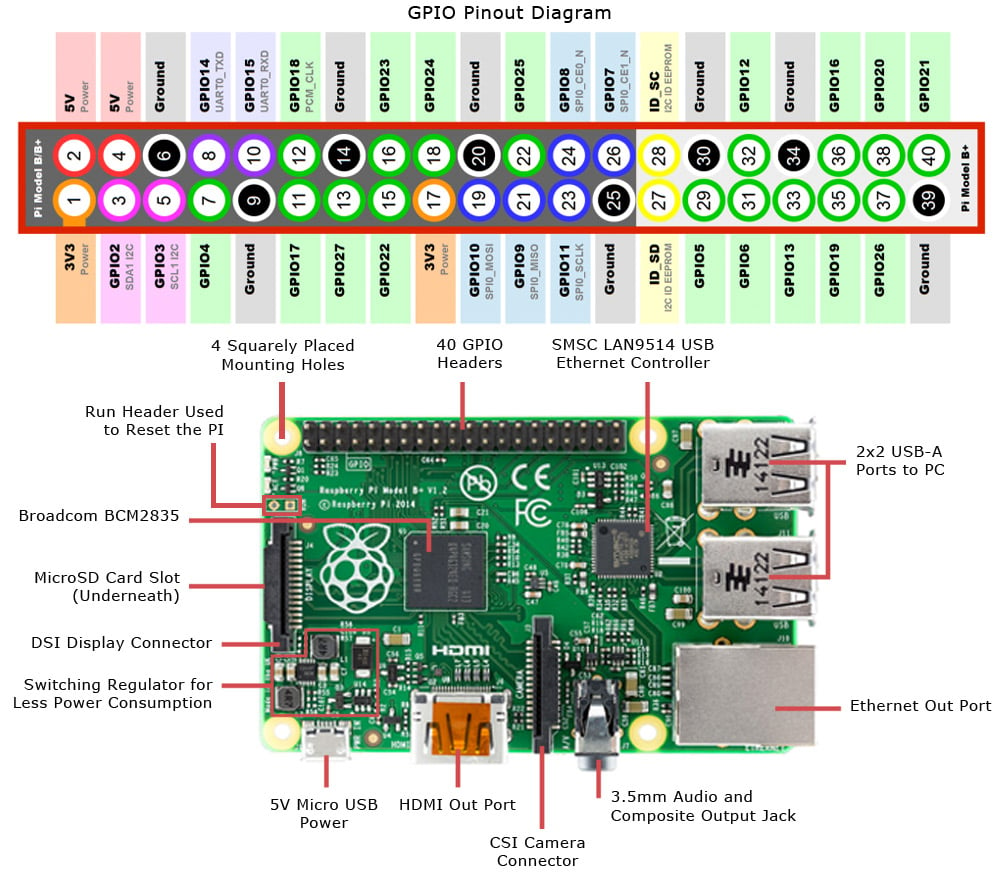

# Trabajo Práctico N°5: Device drivers

## Cátedra de Sistemas de Computación, FCEFyN, UNC. 2025

### Grupo: Los puntos flotantes

### Alumnos: Bernaus, Julieta; Di Pasquo, Franco; Viccini, Carlos Patricio

### Profesor: Jorge, Javier

## Introducción

Este trabajo trata acerca de los device drivers, es decir, el software que permite la interacción sistema operativo - periférico. A partir de este concepto, se debe crear un driver para el dispositivo Raspberry Pi, que permita manejar los IO.

## Desarrollo

### Consigna

La consigna de este trabajo pide diseñar y construir un CDD que permita sensar dos señales externas con un periodo de UN segundo. Luego, una aplicación a nivel de usuario deberá leer UNA de las dos señales y graficarla en función del tiempo. La aplicación tambien debe poder indicarle al CDD cuál de las dos señales leer. Las correcciones de escalas de las mediciones, de ser necesario, se harán a nivel de usuario. Los gráficos de la señal deben indicar el tipo de señal que se está sensando, unidades en abcisas y tiempo en ordenadas. Cuando se cambie de señal el gráfico se debe "resetear" y acomodar a la nueva medición.

### Implementación

Para implementar este trabajo, decidimos utilizar una placa física Raspberry Pi 3 Model B.

A continuación, se presenta el pinout de la placa:

Para poder realizar lo pedido, debimos seguir los siguientes pasos:

1. A través del slot microSD, se le carga una imagen de sistema operativo a la placa. Para la elección de este, se tuvo en cuenta la antigüedad de la placa.
2. Se conecta una fuente de 5V a los pines 15 y 16 de la placa.
3. En una computadora, se establece una conexión por SSH con la Raspberry Pi.

## Conclusión
